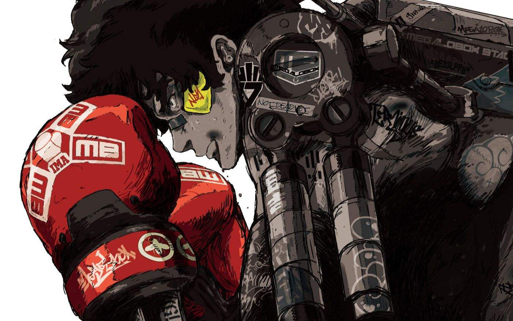

> 本人是一名前端的初学者，将不定时分享一些自己在学习过程中的想法，希望我的文章能对你有所帮助，若你发现文章之中存在某些错误或让你疑惑的位置，也欢迎大家在评论区指出，让我们一起讨论，共同进步！
> 
```!
无论把责任归咎于谁，到头来决定一切的还是自己。
     --JOE  《MEGALO BOX》
```

# 层叠上下文

我们假定用户正面向（浏览器）视窗或网页，而 HTML 元素沿着其相对于用户的一条虚构的 z 轴排开，**层叠上下文**就是对这些 HTML 元素的一个三维构想。每个HTML元素基于其元素属性按照优先级顺序占据这个空间。

## 层叠上下文

文档中的元素，满足下列任一条件就可以形成一个层叠上下文：

1. 文档根元素（`<html>`）；
2. [`position`](https://developer.mozilla.org/zh-CN/docs/Web/CSS/position) 值为 `absolute`（绝对定位）或 `relative`（相对定位）且 [`z-index`](https://developer.mozilla.org/zh-CN/docs/Web/CSS/z-index) 值不为 `auto` 的元素；
3. [`position`](https://developer.mozilla.org/zh-CN/docs/Web/CSS/position) 值为 `fixed`（固定定位）或 `sticky`（粘滞定位）的元素（沾滞定位适配所有移动设备上的浏览器，但老的桌面浏览器不支持）；
4. flex ([`flexbox` (en-US)](https://developer.mozilla.org/en-US/docs/Web/CSS/CSS_Flexible_Box_Layout/Basic_Concepts_of_Flexbox)) 容器的子元素，且 [`z-index`](https://developer.mozilla.org/zh-CN/docs/Web/CSS/z-index) 值不为 `auto`；
5. grid ([`grid`](https://developer.mozilla.org/zh-CN/docs/Web/CSS/grid)) 容器的子元素，且 [`z-index`](https://developer.mozilla.org/zh-CN/docs/Web/CSS/z-index) 值不为 `auto`；
6. [`opacity`](https://developer.mozilla.org/zh-CN/docs/Web/CSS/opacity) 属性值小于 `1` 的元素（参见 [the specification for opacity](http://www.w3.org/TR/css3-color/#transparency)）；
7. [`mix-blend-mode`](https://developer.mozilla.org/zh-CN/docs/Web/CSS/mix-blend-mode) 属性值不为 `normal` 的元素；
8. 以下任意属性值不为 `none` 的元素：
   - [`transform`](https://developer.mozilla.org/zh-CN/docs/Web/CSS/transform)；
   - [`filter`](https://developer.mozilla.org/zh-CN/docs/Web/CSS/filter)；
   - [`perspective`](https://developer.mozilla.org/zh-CN/docs/Web/CSS/perspective)；
   - [`clip-path`](https://developer.mozilla.org/zh-CN/docs/Web/CSS/clip-path)；
   - [`mask`](https://developer.mozilla.org/zh-CN/docs/Web/CSS/mask) / [`mask-image`](https://developer.mozilla.org/zh-CN/docs/Web/CSS/mask-image) / [`mask-border`](https://developer.mozilla.org/zh-CN/docs/Web/CSS/mask-border)；

9. [`isolation`](https://developer.mozilla.org/zh-CN/docs/Web/CSS/isolation) 属性值为 `isolate` 的元素；
10. [`-webkit-overflow-scrolling`](https://developer.mozilla.org/zh-CN/docs/Web/CSS/-webkit-overflow-scrolling) 属性值为 `touch` 的元素；
11. [`will-change`](https://developer.mozilla.org/zh-CN/docs/Web/CSS/will-change) 值设定了任一属性而该属性在 non-initial 值时会创建层叠上下文的元素（参考[这篇文章](http://dev.opera.com/articles/css-will-change-property/)）；
12. [`contain`](https://developer.mozilla.org/zh-CN/docs/Web/CSS/contain) 属性值为 `layout`、`paint` 或包含它们其中之一的合成值（比如 `contain: strict`、`contain: content`）的元素。

在层叠上下文中，子元素同样也按照下面的规则进行层叠。 重要的是，其子级层叠上下文的 `z-index` 值只在父级中才有意义。子级层叠上下文被自动视为父级层叠上下文的一个独立单元。

## z-index属性

通常情况下，[HTML](https://developer.mozilla.org/zh-CN/docs/Glossary/HTML)页面可以被认为是二维的，因为文本，图像和其他元素被排列在页面上而不重叠。在这种情况下，只有一个渲染进程，所有元素都知道其他元素所占用的空间。 [`z-index`](https://developer.mozilla.org/zh-CN/docs/Web/CSS/z-index)属性可让你在渲染内容时调整对象分层的顺序。

*在 CSS 2.1 中, 所有的盒模型元素都处于三维坐标系中。 除了我们常用的横坐标和纵坐标， 盒模型元素还可以沿着“z 轴”层叠摆放， 当他们相互覆盖时， z 轴顺序就变得十分重要。*

### 1. [当没有元素包含z-index属性时，元素按照如下顺序堆叠（从底到顶顺序）](https://developer.mozilla.org/zh-CN/docs/Web/CSS/CSS_Positioning/Understanding_z_index/Stacking_without_z-index)：

1. 根元素的背景和边界
2. 普通流(无定位)里的块元素(没有position或者position:static;)按HTML中的出现顺序堆叠
3. 定位元素按HTML中的出现顺序堆叠

在接下来的例子中，相对和绝对定位的块元素的大小和位置刚好说明上述堆叠规则。

**Notes:**

- 在一组由不含有任何z-index属性的同类元素，如例子中的定位块元素（DIV #1 至 #4），这些元素按照它们在HTML结构中出现的顺序堆叠，而不管它们的定位属性如何。
- 普通流中不含有定位属性的标准块元素（DIV #5）始终先于定位元素渲染并出现在定位元素的下层，即便它们在HTML结构中出现的位置晚于定位元素也是如此。

- 当没有指定z-index的时候， 所有元素都在会被渲染在默认层(0层)
- 当多个元素的z-index属性相同的时候(在同一个层里面)，那么将按照 [未使用 z-index 的层叠](https://developer.mozilla.org/zh-CN/docs/Web/CSS/CSS_Positioning/Understanding_z_index/Stacking_without_z-index) 中描述的规则进行布局。

### 2. [层叠与浮动](https://developer.mozilla.org/zh-CN/docs/Web/CSS/CSS_Positioning/Understanding_z_index/Stacking_and_float)

对于浮动的块元素来说，层叠顺序变得有些不同。浮动块元素被放置于非定位块元素与定位块元素之间：

1. 根元素的背景与边框
2. 位于普通流中的后代块元素按照它们在 HTML 中出现的顺序层叠
3. 浮动块元素
4. 后代中的定位元素按照它们在 HTML 中出现的顺序层叠

实际上，在接下来的例子中你会看到，非定位块元素(DIV #4)的背景与边框丝毫不会受到浮动块元素的影响，但内容却恰恰相反。出现这种情况是由于 CSS 的标准浮动行为引起的。

这种行为可以通过1中的列表的改进版本来解释：

1. 根元素的背景与边框；
2. 位于普通流中的后代块元素按照它们在 HTML 中出现的顺序层叠；
3. 浮动块元素；
4. 常规流中的后代行内元素；
5. 后代中的定位元素按照它们在 HTML 中出现的顺序层叠；

**注意：**(设置透明度会隐式的创建一个层叠上下文。)

### 3. 例子

1. [Stacking context example 1](https://developer.mozilla.org/zh-TW/docs/Web/CSS/CSS_Positioning/Understanding_z_index/Stacking_context_example_1) : 在两层元素的第二层上使用 z-index
2. [Stacking context example 2](https://developer.mozilla.org/zh-CN/docs/Web/CSS/CSS_Positioning/Understanding_z_index/Stacking_context_example_2) : 在两层元素的所有层上使用 z-index
3. [Stacking context example 3](https://developer.mozilla.org/zh-CN/docs/Web/CSS/CSS_Positioning/Understanding_z_index/Stacking_context_example_3) : 在三层元素的第二层上使用 z-index（该案例主要是说明在同一个层叠上下文按照出现的先后顺序来，即1中的规则）
4. 《css世界》作者张鑫旭的[深入理解CSS中的层叠上下文和层叠顺序](https://www.zhangxinxu.com/wordpress/2016/01/understand-css-stacking-context-order-z-index/)

